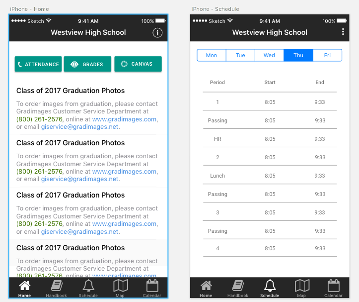
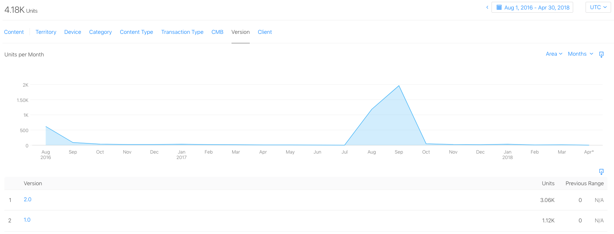

# Westview High School App

Here you will find the source code behind the westview high school app.

Designed and architected by [Ronak Shah](https://github.com/ronakdev), the app itself was coded mainly by [Ronak Shah](https://github.com/ronakdev/), [Deepali Jain](https://github.com/deepalijain), [Mattie Sanseverino](https://github.com/mattiesansev), and [Anushka Gupta](https://github.com/anug8628), with a sponsorship from the Westview WICS club, advised by Tammy Neuhaus.

## App Store Links

- [Google Play](https://play.google.com/store/apps/details?id=io.westviewapp.official&hl=en)
- [iTunes Store](https://itunes.apple.com/us/app/westview-high-school/id1141734049?mt=8)

## Design

Taking inspiration from many university apps, the Westview App focuses on a reliable bell schedule, a map, and an announcements page. It also features a student handbook and a calendar for students to easily access. 

## Stats

Before the redesign: **1.12 thousand** downloads (iTunes)

After the redesign (as of April 2018): **3.06 thousand** downloads (iTunes)

